# Driving Log Replayer Analyzer

Driving Log Replayer で行ったテストの結果ファイルを分析するパッケージ。

## 注意

開発中であり、現状では obstacle_segmentation の result.jsonl の分析のみ可能

## インストール方法

- driving_log_replayer_cli と一緒にインストールされる
- driving_log_replayer と一緒に ros のパッケージとしてインストールされる

## 構成

現状、ROS の機能を使用しない python パッケージとなっているが、ROS のパッケージとしてもインストールされる。
[perception 評価用の依存ライブラリ](https://github.com/tier4/autoware_perception_evaluation)と同じように構成している。

### ROS パッケージにする理由

[Autoware Evaluator](https://docs.web.auto/user-manuals/evaluator/introduction)でビルドして実行されることを考えると、pip などで別途インストールする構成にしてしまうとクラウド基盤側にライブラリを導入するための特別な処理が必要になる。
ROS のパッケージになっていれば、他のパッケージと自動でインストールされる。

## 使い方

```shell
driving_log_replayer_analyzer ${jsonl_path} -c ${config_path}
```

## これからやる

現状では、cli と、ros2 の launch で同じことをやっているだけに過ぎないが、今後用途を以下のように分けていく。



### cli

ユーザーがローカルで分析するために利用する
jsonl から分析結果の html や画像ファイルを出力するために利用する

### ROS 側

driving_log_replayer_analyzer を jsonl 分析のライブラリとしてのみ使用する。
pandas の data frame を jsonl または rosbag で保存しておくことで、Autoware Evaluator のフロントで可視化するための元データにする。
