# log_evaluator_analyzer

log_evaluator で行ったテストの結果ファイルを分析するパッケージ。

## ディレクトリ構成

以下のようなディレクトリ構成を取る。

```shell
log_evaluator_analyzer
├── __init__.py
├── __main__.py      # CLIのエントリーポイント
├── analysis         # CLIの解析コマンド
├── config           # 設定ファイルと設定を読み込むモジュール
├── data             # jsonlからデータを読み込むモジュール
└── plot             # データを描画するモジュール
```

ROS に依存しないパッケージではあるが、ROS のノードにもライブラリとして import されるので、ROS パッケージとしてもインストールされる。

モジュールの役割を図に示す。



## 注意

現状では obstacle_segmentation の result.jsonl の分析のみ可能
必要に応じて、各 use case に対応した分析モジュールを追加する。
analysis, config, data に use_case_name.py ファイルを追加する。

## インストール方法

- log_evaluator_cli と一緒にインストールされる
- log_evaluator と一緒に ros のパッケージとしてインストールされる

## 使い方

```shell
dlr-analyzer analysis ${use-case-name} ${result.jsonl_path} [-c ${config_path}]
```
