# Driving Log Replayer Analyzer

Driving Log Replayer で行ったテストの結果ファイルを分析するパッケージ。

## 構成

以下のようなフォルダ構成を取る。

```shell
driving_log_replayer_analyzer
├── __init__.py
├── __main__.py      # CLIのエントリーポイント
├── analysis         # CLIの解析コマンド
├── config           # 設定ファイルと設定を読み込むモジュール
├── data             # jsonlからデータを読み込むモジュール
└── plot             # データを描画するモジュール
```

図に示すように使用される。
ROS に依存しないパッケージではあるが、ROS のノードにもライブラリとして import されるので、ROS パッケージとしてもインストールされる。



## 注意

現状では obstacle_segmentation の result.jsonl の分析のみ可能
必要に応じて、各 use case に対応した分析モジュールを追加する。
analysis, config, data に use_case 名.py ファイルを追加する。

## インストール方法

- driving_log_replayer_cli と一緒にインストールされる
- driving_log_replayer と一緒に ros のパッケージとしてインストールされる

## 使い方

```shell
driving_log_replayer_analyzer analysis ${use-case-name} ${result.jsonl_path} [-c ${config_path}]
```
