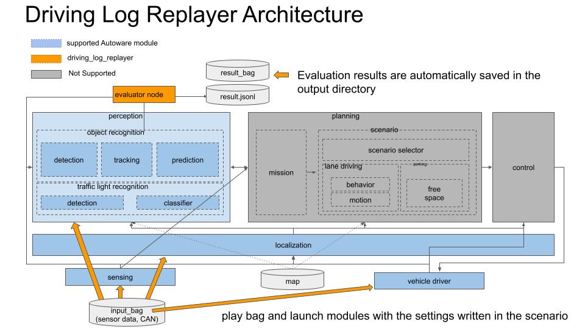

# Introduction

Driving Log Replayer is a package that runs Autoware's open loop simulation using log(rosbag2) and evaluates the topics output by Autoware.
It is used to check the performance of Sensing, Localization, Perception, and for software regression testing.

## Architecture

Driving Log Replayer consists of an Autoware evaluation node added to Autoware's standard functionality.
The architecture graph is shown below.

## Related Documents

1. [AutowareDocumentation](https://autowarefoundation.github.io/autoware-documentation/main/)
2. [WebAutoDocumentation](https://docs.web.auto/)

## Related repositories

1. [ros2bag_extensions](https://github.com/tier4/ros2bag_extensions)
2. [perception_eval](https://github.com/tier4/autoware_perception_evaluation)
