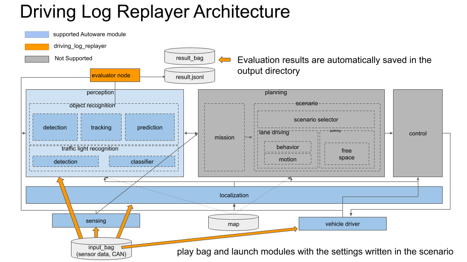

# はじめに

Driving Log Replayerは、log(rosbag2)を用いてAutowareのopen loop simulationを実行し、その結果を評価するパッケージである。
Sensing, Localization, Perceptionの性能確認と、ソフトウェアのリグレッションテストに使用する。

## アーキテクチャ

図に示すように、Autowareの標準機能にDriving Log Replayer固有のシミュレーションの実行機能と評価機能を付加した構成となっている。

## 関連ドキュメント

1. [AutowareDocumentation](https://autowarefoundation.github.io/autoware-documentation/main/ "AutowareDocumentation")
2. [WebAutoDocumentation](https://docs.web.auto/ "Web.Auto DOCS")

## 関連リポジトリ

1. [ros2bag_extensions](https://github.com/tier4/ros2bag_extensions "ros2bag_extensions")
2. [perception_eval](https://github.com/tier4/autoware_perception_evaluation "perception_eval")
