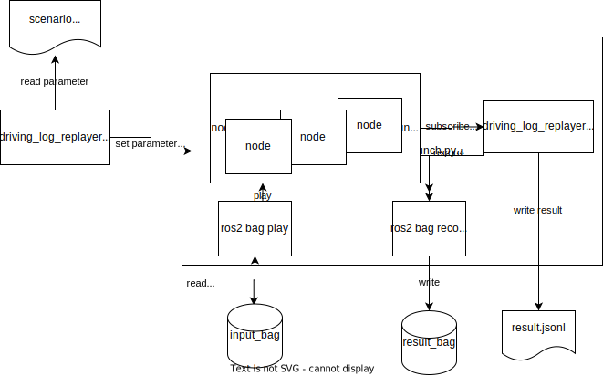

# パッケージ概要

Driving Log Replayerは、評価の条件が記載されたシナリオをパッケージが読み取り、autowareを起動し、評価結果をjsonlファイル形式で出力するという動作を行うパッケージになっている。
概要を図に示す。

## 開発環境

autoware.universeが動作する環境で以下の通りとする。

- Ubuntu 20.04 / 22.04
- ROS galactic / humble
- Python 3.8 / 3.10

## 実行環境

開発環境と同じ。

## 利用フロー

1. 評価用のbagを実車で取得する
2. 取得したbagを必要な時間、topicだけ残るようにフィルタする
    1. ROS2の場合はgalacticでも未だにfilterコマンドが実装されていないのでtier4で開発したros2bag_extensionsを使用する
    2. 収録時にautowareが出力したトピックを落としてセンサートピックだけを残す
    3. 走行前や走行後の評価に不要な時間をカットする(ただし、初期位置位置合わせに車両が静止している時間が3秒以上必要なので走行開始前の10秒程度は残しておく)
3. シナリオを作成する
    1. sampleフォルダ内にシナリオの例あり
    2. 記述方法はフォーマット定義を参照
4. ユースケースがobstacle_segmentation, perceptionの場合、t4_datasetへの変換に対応したアノテーションツールでアノテーションを実施する。
    1. t4_dataset変換ツールは公開準備中
5. 評価を実行する。
