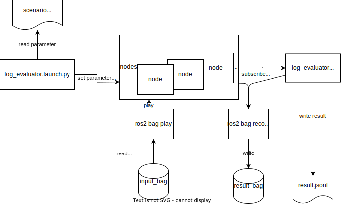

# Overview

Driving Log Replayer is a package that runs Autoware in an open loop by supplying previously recorded input data using log(rosbag2) API. The package gathers information and evaluates topics output produced by Autoware.
Its use is to test the software regression and check Autoware's performance of sensing, localization, and perception components.

## Architecture

Driving Log Replayer package contains an evaluation node that extends Autoware's standard functionality.
The architecture graph is shown below.

## Related Documents

1. [AutowareDocumentation](https://autowarefoundation.github.io/autoware-documentation/main/)
2. [WebAutoDocumentation](https://docs.web.auto/)

## Related repositories

1. [ros2bag_extensions](https://github.com/tier4/ros2bag_extensions)
2. [perception_eval](https://github.com/tier4/autoware_perception_evaluation)

## Package structure

The evaluation node works in the following manner:

- reads a scenario describing the conditions of positive evaluation
- launches autoware
- outputs the evaluation result in a JSON file format

The details of the node's operation are shown in the figure below.

## Example usage flow

1. Acquire rosbags for evaluation using a real-world vehicle.
2. Filter the acquired rosbags to contain only sufficient input topics in required period of time
   - For this purpose please use [ros2bag_extensions](https://github.com/tier4/ros2bag_extensions) package (developed by TIER IV). To properly filter the input rosbag:
     - Autoware's output topics must be dropped except `/tf`. The sensor topics (input topics) should remain in the filtered rosbag.
     - Rosbag needs 10 seconds of parking before driving. The other messages should be dropped.
3. Create an evaluation scenario
   1. Example scenarios could be found in the repository's [sample folder](https://github.com/tier4/driving_log_replayer/tree/main/sample)
   2. Refer to the [format definition](../result_format/index.en.md) section of this document for description contents.
4. If the node should test obstacle_segmentation or perception stacks, please annotate with an annotation tool that supports conversion to t4_dataset.
   1. t4_dataset conversion tool is in preparation for the release.
5. Perform the evaluation.
