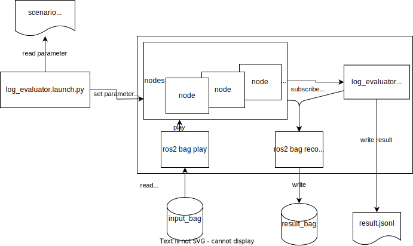

# 概要

Driving Log Replayer は、log(rosbag2)を用いて Autoware の open loop simulation を実行し、Autoware が出力するトピックを評価するパッケージです。
Sensing, Localization, Perception の性能確認と、ソフトウェアのリグレッションテストに使用します。

## 関連ドキュメント

1. [AutowareDocumentation](https://autowarefoundation.github.io/autoware-documentation/main/)
2. [WebAutoDocumentation](https://docs.web.auto/)

## 関連リポジトリ

1. [ros2bag_extensions](https://github.com/tier4/ros2bag_extensions)
2. [perception_eval](https://github.com/tier4/autoware_perception_evaluation)

## アーキテクチャ

Driving Log Replayer は、Autoware の評価ノードを Autoware の標準機能に付加した構成となっている。
アーキテクチャ図を以下に示す。

## パッケージ構成

Driving Log Replayer の評価ノードは、以下のように動作します。

- 評価の条件が記載されたシナリオをパッケージが読み取る
- autoware を起動する
- 評価結果を jsonl ファイル形式で出力する

ノードの動作の詳細を下図に示す。

## 利用フロー

1. 評価用の rosbag を実車で取得する
2. 取得した rosbag を必要な時間、topic だけ残るようにフィルタする
   - フィルタ処理には TIER IV で開発した [ros2bag_extensions](https://github.com/tier4/ros2bag_extensions) を使用する
     - `/tf` を除き収録時に autoware が出力したトピックを落とす。センサーのトピックだけを残す
     - 自己位置合わせのために走行前に 10 秒停車している時間を残しておく
3. シナリオを作成する
   1. [sample folder](https://github.com/tier4/driving_log_replayer/tree/main/sample) 内にシナリオの例あり
   2. 記述内容は[フォーマット定義](../result_format/index.md)を参照
4. ユースケースが obstacle_segmentation, perception の場合、t4_dataset への変換に対応したアノテーションツールでアノテーションを実施する。
   1. t4_dataset 変換ツールは公開準備中
5. 評価を実行する。
