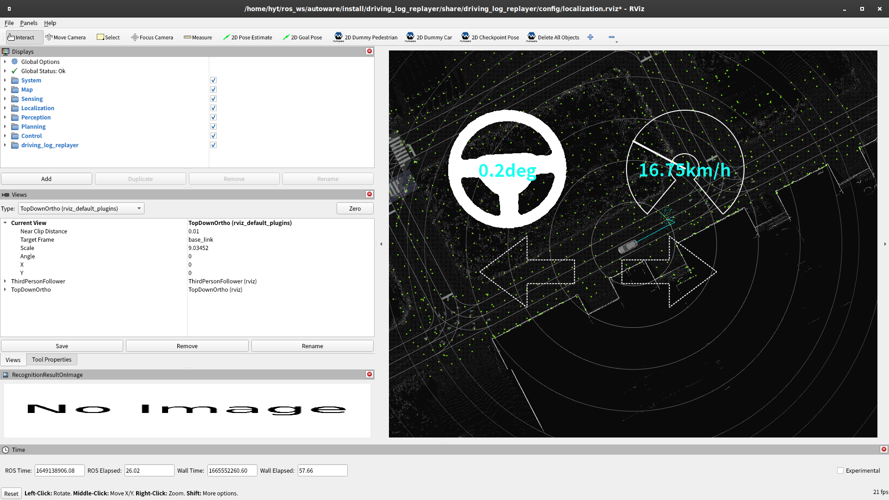

# NDT Localization Evaluation

## Preparation

1. Copy sample scenario

   ```shell
   mkdir -p ~/log_evaluator_data/localization/sample
   cp -r ~/autoware/src/simulator/log_evaluator/sample/localization/scenario.yaml ~/log_evaluator_data/localization/sample
   ```

2. Copy bag file from dataset

   ```shell
   cp -r ~/log_evaluator_data/sample_dataset/input_bag ~/log_evaluator_data/localization/sample
   ```

3. Filter and slice bag

   ```shell
   source ~/autoware/install/setup.bash
   cd ~/log_evaluator_data/localization/sample
   ros2 bag filter input_bag -o filtered_bag -x "/localization/.*" "/sensing/lidar/concatenated/pointcloud" "/tf"
   ros2 bag slice filtered_bag -o sliced_bag -s 1649138880 -e 1649138910
   rm -rf input_bag
   rm -rf filtered_bag
   mv sliced_bag input_bag
   ```

## How to run

1. Run the simulation

   ```shell
   dlr simulation run -p localization  -l play_rate:=0.5
   ```

   

2. Check the results

   Results are displayed in the terminal like below.
   The number of tests will vary slightly depending on PC performance and CPU load conditions, so slight differences are not a problem.

   ```shell
    test case 1 / 1 : use case: sample
    --------------------------------------------------
    TestResult: Passed
    Passed: Convergence (Passed): 281 / 281 -> 100.00%, Reliability (Passed): NVTL Sequential NG Count: 0 (Total Test: 283, Average: 2.476907772225963, StdDev: 0.042055602266257264), NDT Availability (Passed): NDT available
   ```
