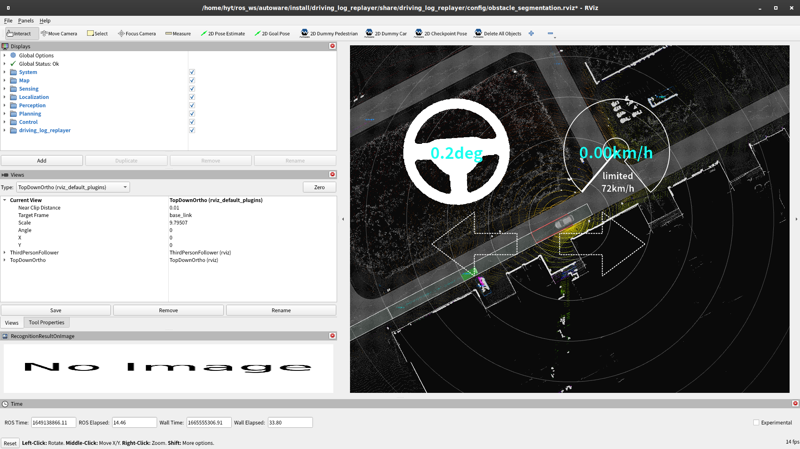

# Obstacle Segmentation の評価

## 準備

1. サンプルのシナリオのコピー

   ```shell
   mkdir -p ~/log_evaluator_data/obstacle_segmentation/sample
   cp -r ~/autoware/src/simulator/log_evaluator/sample/obstacle_segmentation/scenario.yaml ~/log_evaluator_data/obstacle_segmentation/sample
   ```

2. サンプルのデータセットのコピー

   ```shell
   mkdir -p ~/log_evaluator_data/obstacle_segmentation/sample/t4_dataset
   cp -r ~/log_evaluator_data/sample_dataset ~/log_evaluator_data/obstacle_segmentation/sample/t4_dataset
   ```

## 実行方法

1. シミュレーションの実行

   ```shell
   dlr simulation run -p obstacle_segmentation  -l play_rate:=0.5
   ```

   

2. 結果の確認

   以下のような結果がターミナルに表示されます。
   PC の性能や CPU の負荷状況によってテスト回数が若干異なることがありますが、多少の差は問題ありません。

   ```shell
    test case 1 / 1 : use case: sample_dataset
    --------------------------------------------------
    TestResult: Failed
    Detection Failed: detection: 557 / 681 -> 81.79% detection_warn: 0 non_detection: 681 / 681 -> 100.00%
   ```
