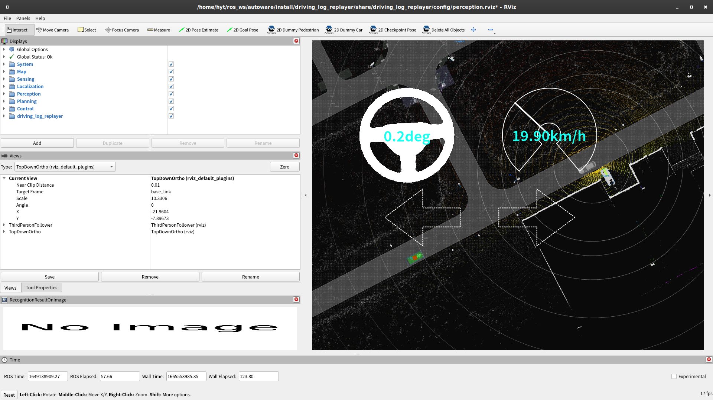

# 認識機能の評価

## 準備

1. サンプルのシナリオのコピー

   ```shell
   mkdir -p ~/driving_log_replayer_data/perception/sample
   cp -r ~/autoware/src/simulator/driving_log_replayer/sample/perception/scenario.yaml ~/driving_log_replayer_data/perception/sample
   ```

2. サンプルのデータセットをコピー

   ```shell
   mkdir -p ~/driving_log_replayer_data/perception/sample/t4_dataset
   cp -r ~/driving_log_replayer_data/sample_dataset ~/driving_log_replayer_data/perception/sample/t4_dataset
   ```

3. 機械学習の学習済みモデルの変換を行う

   ```shell
   source ~/autoware/install/setup
   ros2 launch autoware_launch logging_simulator.launch.xml map_path:=$HOME/autoware_map/sample-map-planning vehicle_model:=sample_vehicle sensor_model:=sample_sensor_kit
   # ~/autoware/install/lidar_centerpoint/share/lidar_centerpoint/dataに以下のファイルができるまで待つ
   # - pts_backbone_neck_head_centerpoint_tiny.engine
   # - pts_voxel_encoder_centerpoint_tiny.engine
   # ファイルが出力されたらCtrl+Cでlaunchを止める
   ```

## 実行方法

1. シミュレーションの実行

   ```shell
   dlr simulation run -p perception  -l "play_rate:=0.5"
   ```

   

2. 結果の確認

   以下のような結果がターミナルに表示されます。
   PC の性能や CPU の負荷状況によってテスト回数が若干異なることがありますが、多少の差は問題ありません。

   ```shell
    test case 1 / 1 : use case: sample
    --------------------------------------------------
    TestResult: Passed
    Passed: 682 / 682 -> 100.00%
   ```
