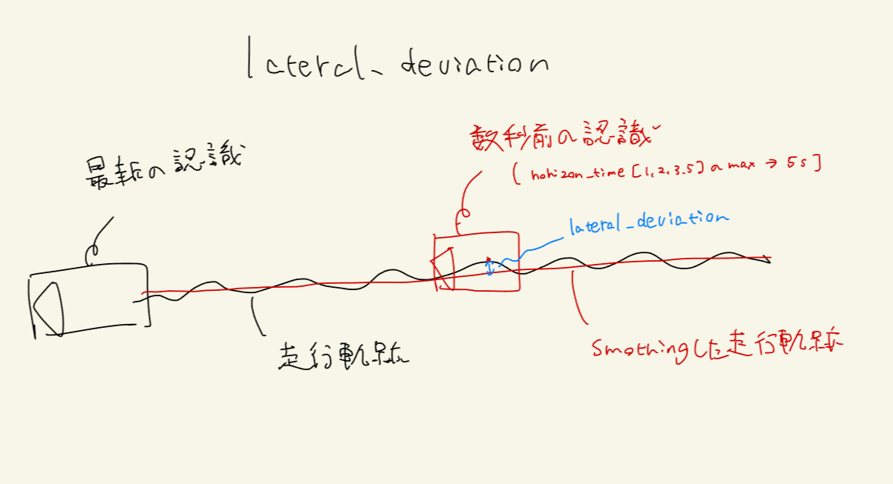
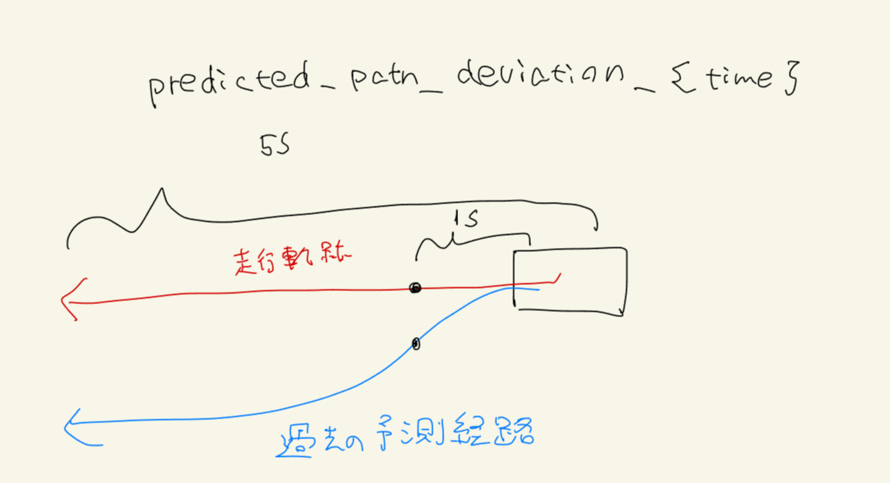

# 認識機能の評価(Annotation Less)

perception_online_evaluatorを利用して、Autowareの認識機能(perception)を、アノテーションなしで評価する。

以下のPRの機能を導入済みのautowareが必要。
<https://github.com/autowarefoundation/autoware.universe/pull/6493>

## 評価方法

`annotation_less_perception.launch.py` を使用して評価する。
launch を立ち上げると以下のことが実行され、評価される。

1. launch で評価ノード(`annotation_less_perception_evaluator_node`)と `logging_simulator.launch`、`ros2 bag play`コマンドを立ち上げる
2. bag から出力されたセンサーデータを autoware が受け取って、perception モジュールが認識を行う
3. perception_online_evaluator が `/diagnostic/perception_online_evaluator/metrics`に診断結果を出力する
4. 評価ノードが topic を subscribe して、各基準を満たしているかを判定して結果をファイルに記録する
5. bag の再生が終了すると自動で launch が終了して評価が終了する

## 評価結果

topic の subscribe 1 回につき、以下に記述する判定結果が出力される。

### 偏差正常

`/diagnostic/perception_online_evaluator/metrics` のstatus.name毎にmin, max, meanの値を加算し、平均値を算出する。
算出された平均値が基準値以下であれば正常とする。

イメージ図を以下に示す



### 偏差異常

偏差正常の条件を満たさないとき

## 評価ノードが使用する Topic 名とデータ型

Subscribed topics:

| Topic name                                      | Data type                             |
| ----------------------------------------------- | ------------------------------------- |
| /diagnostic/perception_online_evaluator/metrics | diagnostic_msgs::msg::DiagnosticArray |

Published topics:

| Topic name | Data type |
| ---------- | --------- |
| N/A        | N/A       |

### 偏差の判定基準値を与える方法

判定の基準値は以下の2通りの方法で与えることができる

#### シナリオに記述する

```yaml
Evaluation:
  UseCaseName: annotation_less_perception
  UseCaseFormatVersion: 0.1.0
  Conditions:
    # Threshold: {} # Metricsを過去に実行したテストのresult.jsonlから指定する場合はここの値は上書きされる。辞書型であれば空でも可。
    Threshold: # 初回実行時などシナリオで指定したい場合はシナリオで指定する
      lateral_deviation: { min: 10.0, max: 10.0, mean: 10.0 }
      yaw_deviation: { min: 10.0, max: 10.0, mean: 10.0 }
      predicted_path_deviation_5.00: { min: 10.0, max: 10.0, mean: 10.0 }
      predicted_path_deviation_3.00: { min: 10.0, max: 10.0, mean: 10.0 }
      predicted_path_deviation_2.00: { min: 10.0, max: 10.0, mean: 10.0 }
      predicted_path_deviation_1.00: { min: 10.0, max: 10.0, mean: 10.0 }
```

#### 以前のテスト結果ファイルから与える

こちらの方法をメインに使う想定。
Autoware Evaluatorで、テストを実行し、出力されたresult.jsonlのファイルパスを指定すると、指定したファイルに記述されている最後のMetrics値を判定基準値として利用する。

利用のイメージを以下に示す。



##### driving-log-replayer-cli

```shell
dlr simulation run -p annnotation_less_perception -l "annotation_less_thresold_file:=${previous_test_result.jsonl_path}"
```

##### WebAutoCLI

```shell
webauto ci scenario run --project-id ${project-id} --scenario-id ${scenario-id} --scenario-version-id ${scenario-version-id} --simulator-parameter-overrides annotation_less_thresold_file=${previous_test_result.jsonl_path}
```

##### Autoware Evaluator

.webauto-ci.ymlのsimulatorの設定でparametersに追加する。

```yaml
simulations:
  - name: annotation_less_perception
    type: annotation_less_perception
    simulator:
      deployment:
        type: container
        artifact: main
      runtime:
        type: simulator/standard1/amd64/medium
      parameters:
        annotation_less_threshold_file: ${previous_test_result.jsonl_path}
```

## logging_simulator.launch に渡す引数

autoware の処理を軽くするため、評価に関係のないモジュールは launch の引数に false を渡すことで無効化する。以下を設定している。

- perception: false
- planning: false
- control: false
- sensing: false / true (デフォルト false、launch引数で与える)

### sensingの引数指定方法

#### driving-log-replayer-cli

```shell
dlr simulation run -p annnotation_less_perception -l "sensing:=true"
```

#### WebAutoCLI

```shell
webauto ci scenario run --project-id ${project-id} --scenario-id ${scenario-id} --scenario-version-id ${scenario-version-id} --simulator-parameter-overrides sensing=true
```

#### Autoware Evaluator

.webauto-ci.ymlのsimulatorの設定でparametersに追加する。

```yaml
simulations:
  - name: annotation_less_perception
    type: annotation_less_perception
    simulator:
      deployment:
        type: container
        artifact: main
      runtime:
        type: simulator/standard1/amd64/medium
      parameters:
        sensing: "true"
```

## simulation

シミュレーション実行に必要な情報を述べる。

### 入力 rosbag に含まれるべき topic

| topic 名                                             | データ型                                     |
| ---------------------------------------------------- | -------------------------------------------- |
| /gsm8/from_can_bus                                   | can_msgs/msg/Frame                           |
| /localization/kinematic_state                        | nav_msgs/msg/Odometry                        |
| /sensing/camera/camera\*/camera_info                 | sensor_msgs/msg/CameraInfo                   |
| /sensing/camera/camera\*/image_rect_color/compressed | sensor_msgs/msg/CompressedImage              |
| /sensing/gnss/ublox/fix_velocity                     | geometry_msgs/msg/TwistWithCovarianceStamped |
| /sensing/gnss/ublox/nav_sat_fix                      | sensor_msgs/msg/NavSatFix                    |
| /sensing/gnss/ublox/navpvt                           | ublox_msgs/msg/NavPVT                        |
| /sensing/imu/tamagawa/imu_raw                        | sensor_msgs/msg/Imu                          |
| /sensing/lidar/concatenated/pointcloud               | sensor_msgs/msg/PointCloud2                  |
| /sensing/lidar/\*/velodyne_packets                   | velodyne_msgs/VelodyneScan                   |
| /tf                                                  | tf2_msgs/msg/TFMessage                       |

CAN の代わりに vehicle の topic を含めても良い。

| topic 名                                             | データ型                                            |
| ---------------------------------------------------- | --------------------------------------------------- |
| /localization/kinematic_state                        | nav_msgs/msg/Odometry                               |
| /sensing/camera/camera\*/camera_info                 | sensor_msgs/msg/CameraInfo                          |
| /sensing/camera/camera\*/image_rect_color/compressed | sensor_msgs/msg/CompressedImage                     |
| /sensing/gnss/ublox/fix_velocity                     | geometry_msgs/msg/TwistWithCovarianceStamped        |
| /sensing/gnss/ublox/nav_sat_fix                      | sensor_msgs/msg/NavSatFix                           |
| /sensing/gnss/ublox/navpvt                           | ublox_msgs/msg/NavPVT                               |
| /sensing/imu/tamagawa/imu_raw                        | sensor_msgs/msg/Imu                                 |
| /sensing/lidar/concatenated/pointcloud               | sensor_msgs/msg/PointCloud2                         |
| /sensing/lidar/\*/velodyne_packets                   | velodyne_msgs/VelodyneScan                          |
| /tf                                                  | tf2_msgs/msg/TFMessage                              |
| /vehicle/status/control_mode                         | autoware_auto_vehicle_msgs/msg/ControlModeReport    |
| /vehicle/status/gear_status                          | autoware_auto_vehicle_msgs/msg/GearReport           |
| /vehicle/status/steering_status                      | autoware_auto_vehicle_msgs/SteeringReport           |
| /vehicle/status/turn_indicators_status               | autoware_auto_vehicle_msgs/msg/TurnIndicatorsReport |
| /vehicle/status/velocity_status                      | autoware_auto_vehicle_msgs/msg/VelocityReport       |

### 入力 rosbag に含まれてはいけない topic

| topic 名 | データ型                |
| -------- | ----------------------- |
| /clock   | rosgraph_msgs/msg/Clock |

clock は、ros2 bag play の--clock オプションによって出力しているので、bag 自体に記録されていると 2 重に出力されてしまうので bag には含めない

## evaluation

評価に必要な情報を述べる。

### シナリオフォーマット

[サンプル](https://github.com/tier4/driving_log_replayer/blob/main/sample/annotation_less_perception/scenario.yaml)参照

### 評価結果フォーマット

[サンプル](https://github.com/tier4/driving_log_replayer/blob/main/sample/annotation_less_perception/result.json)参照

以下に、それぞれの評価の例を記述する。
**注:結果ファイルフォーマットで解説済みの共通部分については省略する。**

```json
{
  "Deviation": {
    "Result": { "Total": "Success or Fail", "Frame": "Success or Fail" }, // TotalとFrameの結果は同じ。他の評価と形式を同じにするために同じ値を出力する。
    "Info": {
      "lateral_deviation": { "min": "最小距離", "max": "最大距離", "mean": "平均距離" },
      "yaw_deviation": { "min": "最小角度差", "max": "最大角度差", "mean": "平均角度差" },
      "predicted_path_deviation_5.00": { "min": "最小距離", "max": "最大距離", "mean": "平均距離" },
      "predicted_path_deviation_3.00": { "min": "最小距離", "max": "最大距離", "mean": "平均距離" },
      "predicted_path_deviation_2.00": { "min": "最小距離", "max": "最大距離", "mean": "平均距離" },
      "predicted_path_deviation_1.00": { "min": "最小距離", "max": "最大距離", "mean": "平均距離" }
    },
    "Metrics": {
      "lateral_deviation": {
        "min": "最小距離平均値",
        "max": "最大距離平均値",
        "mean": "平均距離平均値"
      },
      "yaw_deviation": {
        "min": "最小角度差平均値",
        "max": "最大角度差平均値",
        "mean": "平均角度差平均値"
      },
      "predicted_path_deviation_5.00": {
        "min": "最小距離平均値",
        "max": "最大距離平均値",
        "mean": "平均距離平均値"
      },
      "predicted_path_deviation_3.00": {
        "min": "最小距離平均値",
        "max": "最大距離平均値",
        "mean": "平均距離平均値"
      },
      "predicted_path_deviation_2.00": {
        "min": "最小距離平均値",
        "max": "最大距離平均値",
        "mean": "平均距離平均値"
      },
      "predicted_path_deviation_1.00": {
        "min": "最小距離平均値",
        "max": "最大距離平均値",
        "mean": "平均距離平均値"
      }
    }
  }
}
```

項目の意味は以下の図を参照




