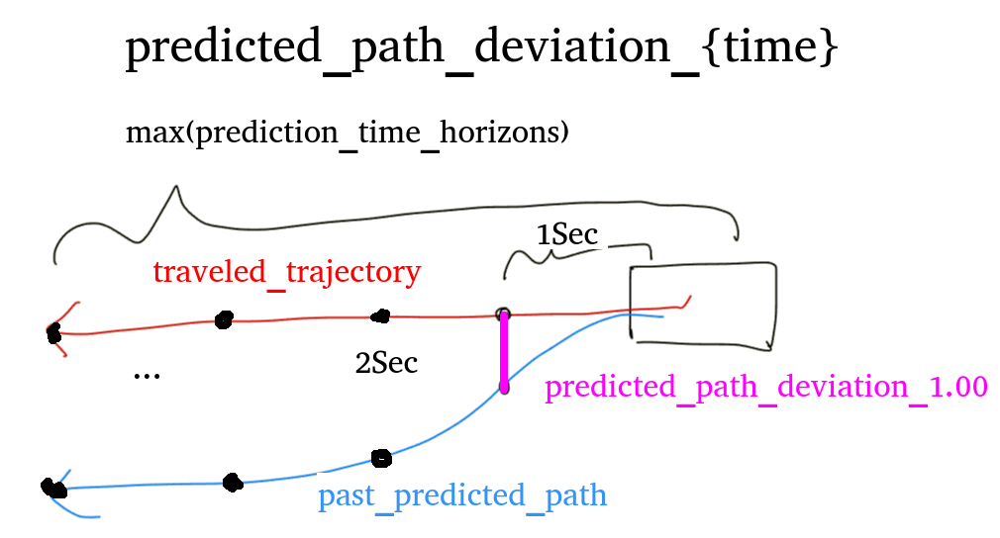

# Evaluate Annotationless Perception

Evaluate Autoware's recognition features (perception) without annotations using the perception_online_evaluator.

Requires Autoware with the following PR features.
<https://github.com/autowarefoundation/autoware.universe/pull/6556>

## Evaluation method

The annotationless_perception evaluation is executed by launching the `annotationless_perception.launch.py` file.
Launching the file executes the following steps:

1. Execute launch of evaluation node (`annotationless_perception_evaluator_node`), `logging_simulator.launch` file and `ros2 bag play` command
2. Autoware receives sensor data output from input rosbag and the perception module performs recognition.
3. The perception_online_evaluator publishes diagnostic topic to `/diagnostic/perception_online_evaluator/metrics`
4. The evaluation node subscribes to the topic and evaluates data. The result is dumped into a file.
5. When the playback of the rosbag is finished, Autoware's launch is automatically terminated, and the evaluation is completed.

## Evaluation results

The output topic of perception_online_evaluator is in the form of the following sample.
[topic sample](https://github.com/tier4/driving_log_replayer/blob/main/sample/annotationless_perception/diag_topic.txt)

For each subscription, the following judgment results are output for each recognition class.

If all classes are normal, the test is successful.

### Deviation Normal

The following two values specified in the scenario or launch argument are used to judge

- Threshold
- PassRange(Coefficient to correct threshold)

Success or failure is determined for each status.name in `/diagnostic/perception_online_evaluator/metrics` according to the following rules.
Items for which no threshold is set (min, max, mean) are always judged as normal. Only those items for which a threshold is specified are subject to evaluation.

#### min

If `threshold * lower_limit` <= `maximum value of min` <= `threshold * upper_limit`, it is assumed to be normal.

Lower limit recommended to be 0.0

#### max

If `threshold * lower_limit` <= `maximum value of max` <= `threshold * upper_limit`, it is assumed to be normal.

Lower limit recommended to be 0.0

#### mean

If `threshold * lower_limit` <= `average value of mean` <= `threshold * upper_limit`, it is assumed to be normal.

An illustration is shown below.


### Deviation Error

When the deviation normal condition is not met

## Topic name and data type used by evaluation node

Subscribed topics:

| Topic name                                      | Data type                             |
| ----------------------------------------------- | ------------------------------------- |
| /diagnostic/perception_online_evaluator/metrics | diagnostic_msgs::msg::DiagnosticArray |

Published topics:

| Topic name | Data type |
| ---------- | --------- |
| N/A        | N/A       |

### Method of specifying conditions

The conditions can be given in two ways

#### Describe in scenario

```yaml
Evaluation:
  UseCaseName: annotationless_perception
  UseCaseFormatVersion: 0.2.0
  Conditions:
    ClassConditions:
      # Describe the conditions for each class. If a class with no conditions is output, only the metrics are calculated. It does not affect the evaluation.
      # In the sample data, the class of TRUCK is also output, but the condition is not described, so TRUCK is always Success.
      # When specifying conditions from result.jsonl, only keys described here will be updated.
      # Even though TRUCK metrics appear in result.jsonl, they are not added to the evaluation condition because the TRUCK key is not specified in this example.
      CAR: # classification key
        Threshold:
          # Keys not described will not be evaluated (will always be a success)
          lateral_deviation: { max: 0.1912, mean: 0.0077 }
          yaw_deviation: { max: 3.1411, mean: 0.9474 }
          predicted_path_deviation_5.00: { max: 16.464, mean: 0.9062 }
          predicted_path_deviation_3.00: { max: 8.3292, mean: 0.4893 }
          predicted_path_deviation_2.00: { max: 5.3205, mean: 0.3109 }
          predicted_path_deviation_1.00: { max: 2.5231, mean: 0.1544 }
        PassRange:
          min: 0.0-2.0 # lower[<=1.0]-upper[>=1.0]
          max: 0.0-2.0 # lower[<=1.0]-upper[>=1.0]
          mean: 0.5-2.0 # lower[<=1.0]-upper[>=1.0]
      BUS: # classification key
        Threshold:
          # Only lateral_deviation is evaluated.
          lateral_deviation: { max: 0.050 } # Only max is evaluated.
        PassRange:
          min: 0.0-2.0 # lower[<=1.0]-upper[>=1.0]
          max: 0.0-2.0 # lower[<=1.0]-upper[>=1.0]
          mean: 0.5-2.0 # lower[<=1.0]-upper[>=1.0]
```

#### Specify by launch argument

This method is assumed to be used mainly.

If the file path of result.jsonl output from past tests is specified, the metrics values from past tests are used as threshold values.
The values are updated from result.jsonl only for the thresholds listed in the scenario.

The passing range can also be specified as an argument.

An image of its use is shown below.


##### driving-log-replayer-cli

```shell
dlr simulation run -p annotationless_perception -l 'annotationless_threshold_file=${previous_test_result.jsonl_path},annotationless_pass_range:={"KEY1":VALUE1"[,"KEY2":"VALUE2"...]}'

# example
dlr simulation run -p annotationless_perception -l 'annotationless_threshold_file:=$HOME/out/annotationless/2024-0314-155106/sample/result.jsonl,annotationless_pass_range:={"CAR":{"min":"0.0-1.1","max":"0.0-1.2","mean":"0.5-1.3"},"BUS":{"min":"0.0-1.1","max":"0.0-1.2","mean":"0.5-1.3"}}'
```

##### WebAutoCLI

```shell
webauto ci scenario run --project-id ${project-id} --scenario-id ${scenario-id} --scenario-version-id ${scenario-version-id} --simulator-parameter-overrides 'annotationless_threshold_file=${previous_test_result.jsonl_path},annotationless_pass_range:={"KEY1":VALUE1"[,"KEY2":"VALUE2"...]}'
```

##### Autoware Evaluator

Add to parameters in the simulator configuration in `.webauto-ci.yml`.

```yaml
simulations:
  - name: annotationless_perception
    type: annotationless_perception
    simulator:
      deployment:
        type: container
        artifact: main
      runtime:
        type: simulator/standard1/amd64/medium
      parameters:
        annotationless_threshold_file: ${previous_test_result.jsonl_path}
        annotationless_pass_range:
          KEY1: VALUE1
          KEY2: VALUE2
```

#### How to update scenario conditions

The driving-log-replayer-cli has the ability to run multiple scenarios in succession that exist under the data_directory of a profile.
On the other hand, when evaluation conditions are given as arguments, the same arguments are applied to multiple scenarios, which is inconvenient.

In the case of local testing using driving-log-replayer-cli, instead of specifying arguments, the following commands are provided so that scenario conditions can be updated as needed.

- update-condition command to manually update scenario conditions
- run's -u option to automatically update scenario conditions after a simulation run

There are two ways to update

- existing Update only those items that appear in the scenario
- all Update all values in the metrics

```shell
# manual update
dlr simulation update-condition -s ${scenario_path} -r ${result.jsonl_path} -u ${existing|all}

# automatically update scenario after simulation run
dlr simulation run -p annotationless_perception -u ${existing|all}
```

## Arguments passed to logging_simulator.launch

To make Autoware processing less resource-consuming, modules that are not relevant to evaluation are disabled by passing the `false` parameter as a launch argument.
The following parameters are set to `false`:

- perception: true
- planning: false
- control: false
- sensing: false / true (default false, set by launch argument)

### How to specify the sensing argument

#### driving-log-replayer-cli

```shell
dlr simulation run -p annotationless_perception -l "sensing:=true"
```

#### WebAutoCLI

```shell
webauto ci scenario run --project-id ${project-id} --scenario-id ${scenario-id} --scenario-version-id ${scenario-version-id} --simulator-parameter-overrides sensing=true
```

#### Autoware Evaluator

Add to parameters in the simulator configuration in `.webauto-ci.yml`.

```yaml
simulations:
  - name: annotationless_perception
    type: annotationless_perception
    simulator:
      deployment:
        type: container
        artifact: main
      runtime:
        type: simulator/standard1/amd64/medium
      parameters:
        sensing: "true"
```

## simulation

State the information required to run the simulation.

### Topic to be included in the input rosbag

| Topic name                             | Data type                                    |
| -------------------------------------- | -------------------------------------------- |
| /gsm8/from_can_bus                     | can_msgs/msg/Frame                           |
| /localization/kinematic_state          | nav_msgs/msg/Odometry                        |
| /sensing/gnss/ublox/fix_velocity       | geometry_msgs/msg/TwistWithCovarianceStamped |
| /sensing/gnss/ublox/nav_sat_fix        | sensor_msgs/msg/NavSatFix                    |
| /sensing/gnss/ublox/navpvt             | ublox_msgs/msg/NavPVT                        |
| /sensing/imu/tamagawa/imu_raw          | sensor_msgs/msg/Imu                          |
| /sensing/lidar/concatenated/pointcloud | sensor_msgs/msg/PointCloud2                  |
| /sensing/lidar/\*/velodyne_packets     | velodyne_msgs/VelodyneScan                   |
| /tf                                    | tf2_msgs/msg/TFMessage                       |

The vehicle topics can be included instead of CAN.

| Topic name                             | Data type                                           |
| -------------------------------------- | --------------------------------------------------- |
| /localization/kinematic_state          | nav_msgs/msg/Odometry                               |
| /sensing/gnss/ublox/fix_velocity       | geometry_msgs/msg/TwistWithCovarianceStamped        |
| /sensing/gnss/ublox/nav_sat_fix        | sensor_msgs/msg/NavSatFix                           |
| /sensing/gnss/ublox/navpvt             | ublox_msgs/msg/NavPVT                               |
| /sensing/imu/tamagawa/imu_raw          | sensor_msgs/msg/Imu                                 |
| /sensing/lidar/concatenated/pointcloud | sensor_msgs/msg/PointCloud2                         |
| /sensing/lidar/\*/velodyne_packets     | velodyne_msgs/VelodyneScan                          |
| /tf                                    | tf2_msgs/msg/TFMessage                              |
| /vehicle/status/control_mode           | autoware_auto_vehicle_msgs/msg/ControlModeReport    |
| /vehicle/status/gear_status            | autoware_auto_vehicle_msgs/msg/GearReport           |
| /vehicle/status/steering_status        | autoware_auto_vehicle_msgs/SteeringReport           |
| /vehicle/status/turn_indicators_status | autoware_auto_vehicle_msgs/msg/TurnIndicatorsReport |
| /vehicle/status/velocity_status        | autoware_auto_vehicle_msgs/msg/VelocityReport       |

### Topics that must not be included in the input rosbag

| Topic name | Data type               |
| ---------- | ----------------------- |
| /clock     | rosgraph_msgs/msg/Clock |

The clock is output by the --clock option of ros2 bag play, so if it is recorded in the bag itself, it is output twice, so it is not included in the bag.

## evaluation

State the information necessary for the evaluation.

### Scenario Format

See [sample](https://github.com/tier4/driving_log_replayer/blob/main/sample/annotationless_perception/scenario.yaml)

### Evaluation Result Format

See [sample](https://github.com/tier4/driving_log_replayer/blob/main/sample/annotationless_perception/result.json)

The format of each frame and the metrics format are shown below.
**NOTE: common part of the result file format, which has already been explained, is omitted.**

```json
{
  "Frame": {
    "Ego": {},
    "OBJECT_CLASSIFICATION": {
      // Recognized class
      "Result": { "Total": "Success or Fail", "Frame": "Success or Fail" }, // The results for Total and Frame are the same. The same values are output to make the data structure the same as other evaluations.
      "Info": {
        "lateral_deviation": {
          "min": "Minimum distance",
          "max": "Maximum distance",
          "mean": "Mean distance"
        },
        "yaw_deviation": {
          "min": "Minimum Angle Difference",
          "max": "Maximum Angle Difference",
          "mean": "Mean Angle Difference"
        },
        "predicted_path_deviation_5.00": {
          "min": "Minimum distance",
          "max": "Maximum distance",
          "mean": "Mean distance"
        },
        "predicted_path_deviation_3.00": {
          "min": "Minimum distance",
          "max": "Maximum distance",
          "mean": "Mean distance"
        },
        "predicted_path_deviation_2.00": {
          "min": "Minimum distance",
          "max": "Maximum distance",
          "mean": "Mean distance"
        },
        "predicted_path_deviation_1.00": {
          "min": "Minimum distance",
          "max": "Maximum distance",
          "mean": "Mean distance"
        }
      },
      "Metrics": {
        "lateral_deviation": {
          "min": "Maximum value of Minimum distance",
          "max": "Maximum value of Maximum distance",
          "mean": "Average value of Mean distance"
        },
        "yaw_deviation": {
          "min": "Maximum value of Minimum Angle Difference",
          "max": "Maximum value of Maximum Angle Difference",
          "mean": "Average value of Mean Angle Difference"
        },
        "predicted_path_deviation_5.00": {
          "min": "Maximum value of Minimum distance",
          "max": "Maximum value of Maximum distance",
          "mean": "Average value of Mean distance"
        },
        "predicted_path_deviation_3.00": {
          "min": "Maximum value of Minimum distance",
          "max": "Maximum value of Maximum distance",
          "mean": "Average value of Mean distance"
        },
        "predicted_path_deviation_2.00": {
          "min": "Maximum value of Minimum distance",
          "max": "Maximum value of Maximum distance",
          "mean": "Average value of Mean distance"
        },
        "predicted_path_deviation_1.00": {
          "min": "Maximum value of Minimum distance",
          "max": "Maximum value of Maximum distance",
          "mean": "Average value of Mean distance"
        }
      }
    }
  }
}
```

See the figure below for the meaning of items



