# Annotationless認識機能の評価

perception_online_evaluatorを利用して、Autowareの認識機能(perception)を、アノテーションなしで評価する。

以下のPRの機能を持つAutowareが必要。
<https://github.com/autowarefoundation/autoware.universe/pull/6556>

## 評価方法

`annotationless_perception.launch.py` を使用して評価する。
launch を立ち上げると以下のことが実行され、評価される。

1. launch で評価ノード(`annotationless_perception_evaluator_node`)と `logging_simulator.launch`、`ros2 bag play`コマンドを立ち上げる
2. bag から出力されたセンサーデータを autoware が受け取って、perception モジュールが認識を行う
3. perception_online_evaluator が `/perception/perception_online_evaluator/metrics`に診断結果を出力する
4. 評価ノードが topic を subscribe して、各基準を満たしているかを判定して結果をファイルに記録する
5. bag の再生が終了すると自動で launch が終了して評価が終了する

## 評価結果

perception_online_evaluatorが出力するtopicは以下のサンプルのような形式となっている。
[topicサンプル](https://github.com/tier4/driving_log_replayer/blob/main/sample/annotationless_perception/diag_topic.txt)

topic の subscribe 1 回につき、認識クラス毎に以下に記述する判定結果が出力される。

全てのクラスで正常となった場合、テストは正常となる。

### 正常

判定には、シナリオまたはlaunchの引数で指定された以下の2つの値を利用する。

- 閾値
- 合格範囲(閾値を補正する係数)

`/perception/perception_online_evaluator/metrics` のstatus.name毎に以下のルールに従い成否の判定が行われる。
閾値が設定されてない項目(min, max, mean)に関しては常に正常と判定される。指定があるもののみが評価対象になる。

#### min

閾値×下限値　＜＝　minの最小値　＜＝　閾値×上限値であれば正常とする。

#### max

閾値×下限値　＜＝　maxの最大値　＜＝　閾値×上限値であれば正常とする。

下限値は0.0にすることを推奨

#### mean

閾値×下限値　＜＝　meanの平均値　＜＝　閾値×上限値であれば正常とする。

#### metric_value

閾値×下限値　＜＝　metric_valueの値　＜＝　閾値×上限値であれば正常とする。

metric_valueは現在の値だけで判定され、min, max, meanのmetricsの値を更新しない。

イメージ図を以下に示す


### 異常

正常の条件を満たさないとき

## 評価ノードが使用する Topic 名とデータ型

Subscribed topics:

| Topic name                                      | Data type                             |
| ----------------------------------------------- | ------------------------------------- |
| /perception/perception_online_evaluator/metrics | diagnostic_msgs::msg::DiagnosticArray |

Published topics:

| Topic name | Data type |
| ---------- | --------- |
| N/A        | N/A       |

### 条件を指定する方法

条件は以下の2通りの方法で与えることができる

#### シナリオに記述する

```yaml
Evaluation:
  UseCaseName: annotationless_perception
  UseCaseFormatVersion: 0.3.0
  Conditions:
    ClassConditions:
      # クラス毎の条件を記述する。条件を設定がないクラスが出力された場合はメトリクスだけ計算される。評価には影響しない
      # サンプルデータではTRUCKのclassも出力されるが条件を記述してないので、TRUCKは必ずSuccessになる
      # result.jsonlから条件指定を行う場合、ここに記述があるキーのみ更新される。
      # result.jsonlにTRUCKのメトリクスが出ていても、この例ではTRUCKのキーを指定していないので評価条件には追加されない。
      CAR: # classification key
        Threshold:
          # 記述のないキーについては評価されない（必ず成功になる）
          lateral_deviation: { max: 0.4, mean: 0.019 }
          yaw_deviation: { max: 3.1411, mean: 0.05 }
          predicted_path_deviation_5.00: { max: 16.464, mean: 1.8 }
          total_objects_count_r60.00_h10.00: { metric_value: 10 }
        PassRange:
          min: 0.0-2.0 # lower[<=1.0]-upper[>=1.0]
          max: 0.0-2.0 # lower[<=1.0]-upper[>=1.0]
          mean: 0.5-2.0 # lower[<=1.0]-upper[>=1.0]
          metric_value: 0.9-1.1
      BUS: # classification key
        Threshold:
          # Only lateral_deviation is evaluated.
          yaw_rate: { max: 0.05 } # Only max is evaluated.
        PassRange:
          min: 0.0-2.0 # lower[<=1.0]-upper[>=1.0]
          max: 0.0-2.0 # lower[<=1.0]-upper[>=1.0]
          mean: 0.5-2.0 # lower[<=1.0]-upper[>=1.0]
          metric_value: 0.9-1.1
```

#### launch引数で指定する

こちらの方法をメインに使う想定。

過去のテストで出力されたresult.jsonlのファイルパスを指定すると、過去のテストのメトリクス値を閾値として利用する。
シナリオに記載のある閾値だけresult.jsonlから値が更新される。

また合格範囲も引数で指定可能。

利用イメージを以下に示す。



##### driving-log-replayer-cli

```shell
dlr simulation run -p annotationless_perception -l annotationless_threshold_file:=${previous_test_result.jsonl_path} -l 'annotationless_pass_range:={"KEY1":VALUE1"[,"KEY2":"VALUE2"...]}'

# example
dlr simulation run -p annotationless_perception -l annotationless_threshold_file:=$HOME/out/annotationless/2024-0314-155106/sample/result.jsonl -l 'annotationless_pass_range:={"CAR":{"min":"0.0-1.1","max":"0.0-1.2","mean":"0.5-1.3"},"BUS":{"min":"0.0-1.1","max":"0.0-1.2","mean":"0.5-1.3"}}'
```

##### WebAutoCLI

```shell
webauto ci scenario run --project-id ${project-id} --scenario-id ${scenario-id} --scenario-version-id ${scenario-version-id} --simulator-parameter-overrides 'annotationless_threshold_file=${previous_test_result.jsonl_path},annotationless_pass_range:={"KEY1":VALUE1"[,"KEY2":"VALUE2"...]}'
```

##### Autoware Evaluator

.webauto-ci.ymlのsimulatorの設定でparametersに追加する。

```yaml
simulations:
  - name: annotationless_perception
    type: annotationless_perception
    simulator:
      deployment:
        type: container
        artifact: main
      runtime:
        type: simulator/standard1/amd64/medium
      parameters:
        annotationless_threshold_file: ${previous_test_result.jsonl_path}
        annotationless_pass_range:
          KEY1: VALUE1
          KEY2: VALUE2
```

#### シナリオの条件を更新する方法

driving-log-replayer-cliではプロファイルのdata_directory配下に存在する複数のシナリオを連続で実行する機能を備えている。
一方で、評価条件を引数で与える場合、複数のシナリオに対して同じ引数が適用されてしまい不都合がある。

driving-log-replayer-cliを用いたローカルテストの場合は、引数指定ではなく、シナリオの条件を随時更新して利用できるように、以下のようなコマンドが用意されている。

- 手動でシナリオの条件を更新するupdate-conditionコマンド
- シミュレーション実行後に自動でシナリオの条件を更新するrunの-uのオプション

更新方法は以下の2通りがある

- existing シナリオに記述のある項目のみ更新
- all メトリクスに出ている値で全て更新

```shell
# manual update
dlr simulation update-condition -s ${scenario_path} -r ${result.jsonl_path} -u ${existing|all}

# automatically update scenario after simulation run
dlr simulation run -p annotationless_perception -u ${existing|all}
```

## logging_simulator.launch に渡す引数

autoware の処理を軽くするため、評価に関係のないモジュールは launch の引数に false を渡すことで無効化する。以下を設定している。

- perception: true
- planning: false
- control: false
- sensing: false / true (デフォルト false、launch引数で与える)

### sensingの引数指定方法

#### driving-log-replayer-cli

```shell
dlr simulation run -p annotationless_perception -l sensing:=true
```

#### WebAutoCLI

```shell
webauto ci scenario run --project-id ${project-id} --scenario-id ${scenario-id} --scenario-version-id ${scenario-version-id} --simulator-parameter-overrides 'sensing=true'
```

#### Autoware Evaluator

.webauto-ci.ymlのsimulatorの設定でparametersに追加する。

```yaml
simulations:
  - name: annotationless_perception
    type: annotationless_perception
    simulator:
      deployment:
        type: container
        artifact: main
      runtime:
        type: simulator/standard1/amd64/medium
      parameters:
        sensing: "true"
```

## simulation

シミュレーション実行に必要な情報を述べる。

### 入力 rosbag に含まれるべき topic

| topic 名                               | データ型                                     |
| -------------------------------------- | -------------------------------------------- |
| /pacmod/from_can_bus                   | can_msgs/msg/Frame                           |
| /localization/kinematic_state          | nav_msgs/msg/Odometry                        |
| /sensing/gnss/ublox/fix_velocity       | geometry_msgs/msg/TwistWithCovarianceStamped |
| /sensing/gnss/ublox/nav_sat_fix        | sensor_msgs/msg/NavSatFix                    |
| /sensing/gnss/ublox/navpvt             | ublox_msgs/msg/NavPVT                        |
| /sensing/imu/tamagawa/imu_raw          | sensor_msgs/msg/Imu                          |
| /sensing/lidar/concatenated/pointcloud | sensor_msgs/msg/PointCloud2                  |
| /sensing/lidar/\*/velodyne_packets     | velodyne_msgs/VelodyneScan                   |
| /tf                                    | tf2_msgs/msg/TFMessage                       |

CAN の代わりに vehicle の topic を含めても良い。

| topic 名                               | データ型                                            |
| -------------------------------------- | --------------------------------------------------- |
| /localization/kinematic_state          | nav_msgs/msg/Odometry                               |
| /sensing/gnss/ublox/fix_velocity       | geometry_msgs/msg/TwistWithCovarianceStamped        |
| /sensing/gnss/ublox/nav_sat_fix        | sensor_msgs/msg/NavSatFix                           |
| /sensing/gnss/ublox/navpvt             | ublox_msgs/msg/NavPVT                               |
| /sensing/imu/tamagawa/imu_raw          | sensor_msgs/msg/Imu                                 |
| /sensing/lidar/concatenated/pointcloud | sensor_msgs/msg/PointCloud2                         |
| /sensing/lidar/\*/velodyne_packets     | velodyne_msgs/VelodyneScan                          |
| /tf                                    | tf2_msgs/msg/TFMessage                              |
| /vehicle/status/control_mode           | autoware_auto_vehicle_msgs/msg/ControlModeReport    |
| /vehicle/status/gear_status            | autoware_auto_vehicle_msgs/msg/GearReport           |
| /vehicle/status/steering_status        | autoware_auto_vehicle_msgs/SteeringReport           |
| /vehicle/status/turn_indicators_status | autoware_auto_vehicle_msgs/msg/TurnIndicatorsReport |
| /vehicle/status/velocity_status        | autoware_auto_vehicle_msgs/msg/VelocityReport       |

### 入力 rosbag に含まれてはいけない topic

| topic 名 | データ型                |
| -------- | ----------------------- |
| /clock   | rosgraph_msgs/msg/Clock |

clock は、ros2 bag play の--clock オプションによって出力しているので、bag 自体に記録されていると 2 重に出力されてしまうので bag には含めない

## evaluation

評価に必要な情報を述べる。

### シナリオフォーマット

[サンプル](https://github.com/tier4/driving_log_replayer/blob/main/sample/annotationless_perception/scenario.ja.yaml)参照

### 評価結果フォーマット

[サンプル](https://github.com/tier4/driving_log_replayer/blob/main/sample/annotationless_perception/result.json)参照

以下に、それぞれの評価の例を記述する。
**注:結果ファイルフォーマットで解説済みの共通部分については省略する。**

```json
{
  "Frame": {
    "Ego": {},
    "OBJECT_CLASSIFICATION": {
      // 認識したクラス
      "Result": { "Total": "Success or Fail", "Frame": "Success or Fail" }, // TotalとFrameの結果は同じ。他の評価とデータ構造を同じにするために同じ値を出力している
      "Info": {
        "name_min_max_mean": { "min": "最小値", "max": "最大値", "mean": "平均値" },
        "name_metric_value": { "metric_value": "値"},
        ...
      },
      "Metrics": {
        "name_min_max_mean": {
          "min": "minの最小値",
          "max": "maxの最大値",
          "mean": "meanの平均値"
        },
        ...
      }
    }
  }
}
```

項目の意味は以下の図を参照


