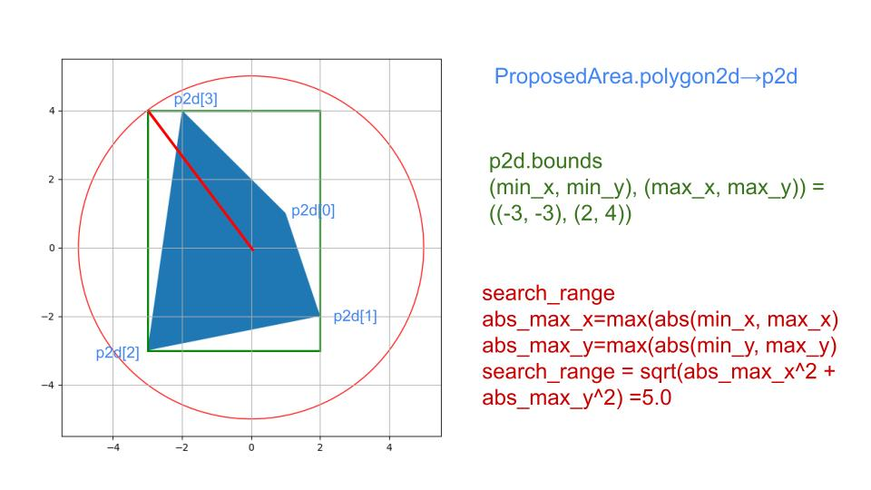

# Evaluate point cloud generation

Evaluate if the Autoware point cloud generation process (if there is a connection between sensing and perception nodes) runs, and if data is being published to the `/perception/obstacle_segmentation/pointcloud` topic as intended.

The following evaluations are performed simultaneously to check if point cloud published by perception nodes is valid.

- Check whether vehicles, pedestrians and other traffic participants, annotated in advance, are detected (detection step).
- Check whether extra point clouds appear in the overlapping area between the lane and the polygons around the vehicle defined in the scenario (non_detection step).

It is also possible not to evaluate if null is specified as the evaluation condition.
In other words, evaluation can be performed in the following three modes.

1. evaluate detection and non_detection at the same time
2. evaluate only detection (NonDetection: null)
3. Evaluate only non_detection (Detection: null)

The recommended annotation tool is [Deepen](https://www.deepen.ai/), but any tool that supports conversion to `t4_dataset` format can be used.
Multiple annotation tools can be used as long as a conversion tool can be created.

## Evaluation method

The obstacle segmentation evaluation is executed by launching the `obstacle_segmentation.launch.py` file.
Launching the file executes the following steps:

1. Execute launch of evaluation node (`obstacle_segmentation_evaluator_node`), `logging_simulator.launch` file and `ros2 bag play` command
2. Autoware receives sensor data output from input rosbag and outputs `/perception/obstacle_segmentation/pointcloud` topic.
3. The evaluation node subscribes `/perception/obstacle_segmentation/pointcloud` topic and calculates the polygon of the non-detection area at the time specified in the header.
4. The evaluation node passes the point cloud and the polygon of the non-detected area to perception_eval for evaluation. The result is dumped into a file.
5. When the playback of the rosbag is finished, Autoware's launch is automatically terminated, and the evaluation is completed.

### How to calculate polygon for non-detectable area

The non-detect area is calculated as the area where the polygon given in the scenario overlaps with the road_lanelet.
It is calculated according to the following steps:

1. get the transform of map_to_base_link at the time of the header.stamp in pointcloud, and transform the polygon to the map coordinate system.
2. get the road_lanelet in the range of search_range (see the figure below) from the point where the vehicle is.
3. take the intersection of the road_lanelet and polygon obtained in step 2.
4. return the array of polygons obtained in step 3 to the base_link coordinate system (to match the coordinate system to filter the pointcloud).



In step 2, by narrowing down to the lanelets in the range where polygons can exist, the intersection process with lanelets that are obvious to return empty polygons in step 3 is omitted.

## Evaluation Result

The results are calculated for each subscription. The format and available states are described below.

### Detection Normal

If all of the following conditions are met, the evaluation is reported as normal:

1. A bounding box with the UUID specified in the scenario must contain a point cloud (topic `/perception/obstacle_segmentation/pointcloud`) with at least a number of points equal to the specified number.
   - If multiple UUIDs are specified, the condition must be satisfied for all the specified bounding boxes.
2. The output rate of the point cloud cannot be in error state (this data is provided by Autoware's diagnostic function). The default frequency value is 1.0Hz.

### Detection Warning

The state is achieved when the visibility of the bounding box with the UUID specified in the scenario is none (bounding box is occluded) and cannot be evaluated.

### Detection Error

The detection state is `Error` when neither conditions for `Normal` nor `Warning` state cannot be met.

### Non-Detection Normal

The state is `Normal` when no point is contained in the non-detection area, which is calculated by the node in step 3 of the evaluation method.

### Non-Detection Error

The state is `Error` when any point was found in the non-detection area.

## Topic name and data type used by evaluation node

Subscribed topics:

| Topic name                                      | Data type                                    |
| ----------------------------------------------- | -------------------------------------------- |
| /perception/obstacle_segmentation/pointcloud    | sensor_msgs::msg::PointCloud2                |
| /diagnostics_agg                                | diagnostic_msgs::msg::DiagnosticArray        |
| /tf                                             | tf2_msgs/msg/TFMessage                       |
| /planning/scenario_planning/status/stop_reasons | tier4_planning_msgs::msg::StopReasonArray    |
| /planning/scenario_planning/trajectory          | autoware_auto_planning_msgs::msg::Trajectory |

Published topics:

| Topic name                                 | Data type                            |
| ------------------------------------------ | ------------------------------------ |
| /driving_log_replayer/marker/detection     | visualization_msgs::msg::MarkerArray |
| /driving_log_replayer/marker/non_detection | visualization_msgs::msg::MarkerArray |
| /driving_log_replayer/pcd/detection        | sensor_msgs::msg::PointCloud2        |
| /driving_log_replayer/pcd/non_detection    | sensor_msgs::msg::PointCloud2        |
| /planning/mission_planning/goal            | geometry_msgs::msg::PoseStamped      |

## Arguments passed to logging_simulator.launch

To make Autoware processing less resource-consuming, modules that are not relevant to evaluation are disabled by passing the `false` parameter as a launch argument.
The following parameters are set to `false`:

- localization: false
- control: false

## About simulation

State the information required to run the simulation.

### Topic to be included in the input rosbag

Must contain the required topics in `t4_dataset` format.

The vehicle's ECU CAN and sensors data topics are required for the evaluation to be run correctly.
The following example shows the topic list available in evaluation input rosbag when multiple LiDARs.

| Topic name                         | Data type                                    |
| ---------------------------------- | -------------------------------------------- |
| /gsm8/from_can_bus                 | can_msgs/msg/Frame                           |
| /localization/kinematic_state      | Type: nav_msgs/msg/Odometry                  |
| /sensing/gnss/ublox/fix_velocity   | geometry_msgs/msg/TwistWithCovarianceStamped |
| /sensing/gnss/ublox/nav_sat_fix    | sensor_msgs/msg/NavSatFix                    |
| /sensing/gnss/ublox/navpvt         | ublox_msgs/msg/NavPVT                        |
| /sensing/imu/tamagawa/imu_raw      | sensor_msgs/msg/Imu                          |
| /sensing/lidar/\*/velodyne_packets | velodyne_msgs/VelodyneScan                   |
| /tf                                | tf2_msgs/msg/TFMessage                       |

The vehicle topics can be included instead of CAN.

| Topic name                             | Data type                                           |
| -------------------------------------- | --------------------------------------------------- |
| /localization/kinematic_state          | Type: nav_msgs/msg/Odometry                         |
| /sensing/gnss/ublox/fix_velocity       | geometry_msgs/msg/TwistWithCovarianceStamped        |
| /sensing/gnss/ublox/nav_sat_fix        | sensor_msgs/msg/NavSatFix                           |
| /sensing/gnss/ublox/navpvt             | ublox_msgs/msg/NavPVT                               |
| /sensing/imu/tamagawa/imu_raw          | sensor_msgs/msg/Imu                                 |
| /sensing/lidar/\*/velodyne_packets     | velodyne_msgs/VelodyneScan                          |
| /tf                                    | tf2_msgs/msg/TFMessage                              |
| /vehicle/status/control_mode           | autoware_auto_vehicle_msgs/msg/ControlModeReport    |
| /vehicle/status/gear_status            | autoware_auto_vehicle_msgs/msg/GearReport           |
| /vehicle/status/steering_status        | autoware_auto_vehicle_msgs/SteeringReport           |
| /vehicle/status/turn_indicators_status | autoware_auto_vehicle_msgs/msg/TurnIndicatorsReport |
| /vehicle/status/velocity_status        | autoware_auto_vehicle_msgs/msg/VelocityReport       |

### Topics that must not be included in the input rosbag

| Topic name | Data type               |
| ---------- | ----------------------- |
| /clock     | rosgraph_msgs/msg/Clock |

The clock is output by the --clock option of ros2 bag play, so if it is recorded in the bag itself, it is output twice, so it is not included in the bag.

## About Evaluation

State the information necessary for the evaluation.

### Scenario Format

See [sample](https://github.com/tier4/driving_log_replayer/blob/main/sample/obstacle_segmentation/scenario.yaml).

### Evaluation Result Format

See [sample](https://github.com/tier4/driving_log_replayer/blob/main/sample/obstacle_segmentation/result.json).

In `obstacle_segmentation` evaluation scenario, two types of checks, detection (Detection) and non-detection (NonDetection), are evaluated.
Although they are evaluated simultaneously, in one callback function, they are counted separately.
The `Result` is `true` if both detection and non-detection evaluation steps have passed. Otherwise the `Result` is `false`.

An example of evaluation is described below.
**NOTE: common part of the result file format, which has already been explained, is omitted.**

```json
{
  "Frame": {
    "FrameName": "Frame number of t4_dataset used for evaluation",
    "FrameSkip": "Number of times that an object was requested to be evaluated but the evaluation was skipped because there was no ground truth in the dataset within 75msec",
    "StopReasons": "Reasons for stopping output by the Planning module. Reference value",
    "TopicRate": "Result of diag indicating whether the output rate of the point cloud is normal or not.",
    "Detection": {
      "Result": { "Total": "Success or Fail", "Frame": "Success, Fail, Warn or Invalid" },
      "Info": {
        "DetectionSuccess or DetectionFail or DetectionWarn": {
          "Annotation": {
            "Scale": {
              "x": "Length of bounding box in x-direction",
              "y": "Length of bounding box in y-direction",
              "z": "Length of bounding box in z-direction"
            },
            "Position": {
              "position": {
                "x": "Bounding box position x",
                "y": "Bounding box position y",
                "z": "Bounding box position z"
              },
              "orientation": {
                "x": "Bounding box direction x",
                "y": "Bounding box direction y",
                "z": "Bounding box direction z",
                "w": "Bounding box direction w"
              }
            },
            "UUID": "UUID of the bounding box",
            "StampFloat": "Bounding box unix_time[us] made into a float."
          },
          "PointCloud": {
            "NumPoints": "Number of point clouds contained within the bounding box.",
            "Nearest": "[x,y,z] coordinates of the closest point in the bounding box from the base_link",
            "Stamp": {
              "sec": "Sec of header.stamp of the point cloud",
              "nanosec": "NanoSec of header.stamp of the point cloud"
            }
          }
        }
      }
    },
    "NonDetection": {
      "Result": "Success, Fail, or Invalid",
      "Info": {
        "PointCloud": {
          "NumPoints": "Number of point clouds out in non-detected areas.",
          "Distance": {
            "0-1": "Number of point clouds out in non-detected areas between 0-1 m from base_link",
            "x-x+1": "Distribution of point clouds appearing in non-detected areas by distance",
            "99-100": "Number of point clouds out in non-detected areas between 99-100 m from base_link"
          }
        }
      }
    }
  }
}
```
