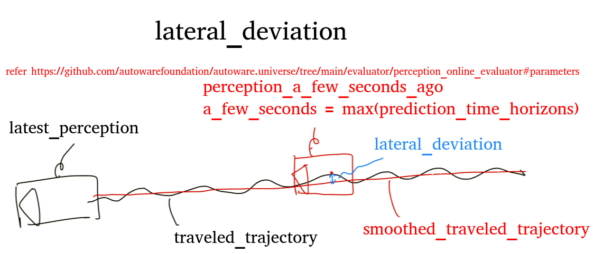

# Planning Controlの評価

Planning ControlのMetricsが指定の時刻、条件で出力されているか評価する

## 評価方法

`planning_control.launch.py` を使用して評価する。
launch を立ち上げると以下のことが実行され、評価される。

1. launch で評価ノード(`planning_control_evaluator_node`)と `logging_simulator.launch`、`ros2 bag play`コマンドを立ち上げる
2. bag から出力されたセンサーデータを autoware が受け取って、perception モジュールが認識を行う
3. perceptionの結果を使って、planningは `/planning/planning_evaluator/metrics(仮)` に controlは `/control/control_evaluator/metrics`にMetricsを出力する
4. 評価ノードが topic を subscribe して、各基準を満たしているかを判定して結果をファイルに記録する
5. bag の再生が終了すると自動で launch が終了して評価が終了する

## 評価結果

controlが出力するtopicは以下のサンプルのような形式となっている。
[topicサンプル](https://github.com/tier4/driving_log_replayer/blob/main/sample/planning_control/diag_topic.txt)

topic の subscribe 1 回につき、headerの時刻で評価する条件があれば評価され判定結果が出力される。
※headerの時刻に該当する評価条件がない場合は捨てられるのでログも出力されない。

### 正常

### 異常

正常の条件を満たさないとき

## 評価ノードが使用する Topic 名とデータ型

Subscribed topics:

| Topic name                                      | Data type                             |
| ----------------------------------------------- | ------------------------------------- |
| /control/control_evaluator/metrics | diagnostic_msgs::msg::DiagnosticArray |
| /planning/planning_evaluator/metrics (仮) | diagnostic_msgs::msg::DiagnosticArray |

Published topics:

| Topic name | Data type |
| ---------- | --------- |
| N/A        | N/A       |

## logging_simulator.launch に渡す引数

autoware の処理を軽くするため、評価に関係のないモジュールは launch の引数に false を渡すことで無効化する。以下を設定している。

- sensing: false / true (デフォルト false、launch引数で与える)
- localization: false
- perception: true
- planning: true
- control: true

### sensingの引数指定方法

#### driving-log-replayer-cli

```shell
dlr simulation run -p annotationless_perception -l sensing:=true
```

## simulation

シミュレーション実行に必要な情報を述べる。

### 入力 rosbag に含まれるべき topic

| topic 名                               | データ型                                     |
| -------------------------------------- | -------------------------------------------- |
| /gsm8/from_can_bus                     | can_msgs/msg/Frame                           |
| /localization/kinematic_state          | nav_msgs/msg/Odometry                        |
| /localization/kinematic_state          | nav_msgs/msg/Odometry                        |
| /sensing/gnss/ublox/fix_velocity       | geometry_msgs/msg/TwistWithCovarianceStamped |
| /sensing/gnss/ublox/nav_sat_fix        | sensor_msgs/msg/NavSatFix                    |
| /sensing/gnss/ublox/navpvt             | ublox_msgs/msg/NavPVT                        |
| /sensing/imu/tamagawa/imu_raw          | sensor_msgs/msg/Imu                          |
| /sensing/lidar/concatenated/pointcloud | sensor_msgs/msg/PointCloud2                  |
| /sensing/lidar/\*/velodyne_packets     | velodyne_msgs/VelodyneScan                   |
| /tf                                    | tf2_msgs/msg/TFMessage                       |

CAN の代わりに vehicle の topic を含めても良い。

| topic 名                               | データ型                                            |
| -------------------------------------- | --------------------------------------------------- |
| /localization/kinematic_state          | nav_msgs/msg/Odometry                               |
| /sensing/gnss/ublox/fix_velocity       | geometry_msgs/msg/TwistWithCovarianceStamped        |
| /sensing/gnss/ublox/nav_sat_fix        | sensor_msgs/msg/NavSatFix                           |
| /sensing/gnss/ublox/navpvt             | ublox_msgs/msg/NavPVT                               |
| /sensing/imu/tamagawa/imu_raw          | sensor_msgs/msg/Imu                                 |
| /sensing/lidar/concatenated/pointcloud | sensor_msgs/msg/PointCloud2                         |
| /sensing/lidar/\*/velodyne_packets     | velodyne_msgs/VelodyneScan                          |
| /tf                                    | tf2_msgs/msg/TFMessage                              |
| /vehicle/status/control_mode           | autoware_auto_vehicle_msgs/msg/ControlModeReport    |
| /vehicle/status/gear_status            | autoware_auto_vehicle_msgs/msg/GearReport           |
| /vehicle/status/steering_status        | autoware_auto_vehicle_msgs/SteeringReport           |
| /vehicle/status/turn_indicators_status | autoware_auto_vehicle_msgs/msg/TurnIndicatorsReport |
| /vehicle/status/velocity_status        | autoware_auto_vehicle_msgs/msg/VelocityReport       |

### 入力 rosbag に含まれてはいけない topic

| topic 名 | データ型                |
| -------- | ----------------------- |
| /clock   | rosgraph_msgs/msg/Clock |

clock は、ros2 bag play の--clock オプションによって出力しているので、bag 自体に記録されていると 2 重に出力されてしまうので bag には含めない

## evaluation

評価に必要な情報を述べる。

### シナリオフォーマット

[サンプル](https://github.com/tier4/driving_log_replayer/blob/main/sample/annotationless_perception/scenario.ja.yaml)参照

### 評価結果フォーマット

[サンプル](https://github.com/tier4/driving_log_replayer/blob/main/sample/annotationless_perception/result.json)参照

以下に、それぞれの評価の例を記述する。
**注:結果ファイルフォーマットで解説済みの共通部分については省略する。**

```json
{
  "Frame": {
    "Ego": {},
    "OBJECT_CLASSIFICATION": {
      // 認識したクラス
      "Result": { "Total": "Success or Fail", "Frame": "Success or Fail" }, // TotalとFrameの結果は同じ。他の評価とデータ構造を同じにするために同じ値を出力している
      "Info": {
        "lateral_deviation": { "min": "最小距離", "max": "最大距離", "mean": "平均距離" },
        "yaw_deviation": { "min": "最小角度差", "max": "最大角度差", "mean": "平均角度差" },
        "predicted_path_deviation_5.00": {
          "min": "最小距離",
          "max": "最大距離",
          "mean": "平均距離"
        },
        "predicted_path_deviation_3.00": {
          "min": "最小距離",
          "max": "最大距離",
          "mean": "平均距離"
        },
        "predicted_path_deviation_2.00": {
          "min": "最小距離",
          "max": "最大距離",
          "mean": "平均距離"
        },
        "predicted_path_deviation_1.00": {
          "min": "最小距離",
          "max": "最大距離",
          "mean": "平均距離"
        }
      },
      "Metrics": {
        "lateral_deviation": {
          "min": "最小距離の最大値",
          "max": "最大距離の最大値",
          "mean": "平均距離の平均値"
        },
        "yaw_deviation": {
          "min": "最小角度差の最大値",
          "max": "最大角度差の最大値",
          "mean": "平均角度差の平均値"
        },
        "predicted_path_deviation_5.00": {
          "min": "最小距離の最大値",
          "max": "最大距離の最大値",
          "mean": "平均距離の平均値"
        },
        "predicted_path_deviation_3.00": {
          "min": "最小距離の最大値",
          "max": "最大距離の最大値",
          "mean": "平均距離の平均値"
        },
        "predicted_path_deviation_2.00": {
          "min": "最小距離の最大値",
          "max": "最大距離の最大値",
          "mean": "平均距離の平均値"
        },
        "predicted_path_deviation_1.00": {
          "min": "最小距離の最大値",
          "max": "最大距離の最大値",
          "mean": "平均距離の平均値"
        }
      }
    }
  }
}
```

項目の意味は以下の図を参照




